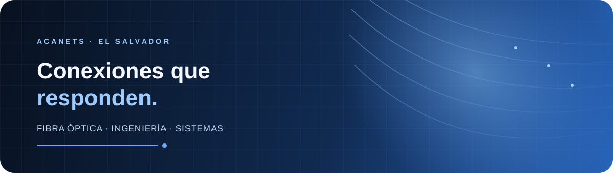

<table>
  <tr>
    <td width="36%" align="center" valign="middle">
      <picture>
        <source media="(prefers-color-scheme: dark)" srcset="./assets/acanets-logo-dark.png">
        <source media="(prefers-color-scheme: light)" srcset="./assets/acanets-logo-light.png">
        
      </picture>
    </td>
    <td width="64%" valign="middle">
      <h1>Conectamos el futuro de El Salvador</h1>
      
<strong>Internet de fibra óptica · Ingeniería · Sistemas</strong>

      
Conectividad confiable y soluciones tecnológicas diseñadas para avanzar sin interrupciones.

      

        
        <strong> 7630-0536</strong> · El Salvador, Centroamérica
      

    </td>
  </tr>
</table>

 

  

 

<table border="0" cellpadding="18" cellspacing="0">
  <tr>
    <td width="58%" valign="top">
      
<strong>TECNOLOGÍA HECHA CERCA</strong>

      <h2>Soluciones claras para avanzar sin interrupciones.</h2>
      
ACANETS, S.A.S. de C.V. es una empresa salvadoreña fundada Marvin Alvarenga con una visión clara: acercar la tecnología a hogares, negocios y organizaciones.

      
Instalamos internet residencial por fibra óptica y desarrollamos soluciones de ingeniería y sistemas confiables, escalables y pensadas para cada cliente.

    </td>
    <td width="42%" valign="top" bgcolor="#101A2B">
      
<strong>NUESTRA PROMESA</strong>

      <h3>La tecnología debe sentirse simple.</h3>
      
Conexiones estables, asesoría clara y acompañamiento profesional en cada proyecto.

      
<strong>01</strong> Diagnóstico transparente  <strong>02</strong> Soluciones escalables  <strong>03</strong> Soporte técnico cercano

    </td>
  </tr>
</table>

---

## Soluciones para conectar mejor

|   <strong>Fibra óptica</strong> Instalación y despliegue de redes. |   <strong>Internet residencial</strong> Conectividad para hogares y familias. |   <strong>Ingeniería y sistemas</strong> Diseño y consultoría tecnológica. |   <strong>Soporte técnico</strong> Acompañamiento profesional cercano. |
| :---: | :---: | :---: | :---: |

## Planes de internet residencial

<table border="0" cellpadding="18" cellspacing="10">
  <tr>
    <td width="33%" valign="top" bgcolor="#101A2B">
      
<strong>PLAN BÁSICO</strong>

      <h2>20 Mbps</h2>
      
<strong>$20.00 / mes</strong>

      

      
Navegación rápida Uso cotidiano Soporte técnico

    </td>
    <td width="33%" valign="top" bgcolor="#173A70">
      
<strong>PLAN ESTÁNDAR · PROMOCIÓN</strong>

      <h2>30 Mbps</h2>
      
<strong>$24.99 / mes</strong>

      

      
Streaming HD Trabajo y juegos en línea Soporte técnico

    </td>
    <td width="33%" valign="top" bgcolor="#101A2B">
      
<strong>PLAN PREMIUM</strong>

      <h2>40 Mbps</h2>
      
<strong>$28.00 / mes</strong>

      

      
Múltiples dispositivos Máxima velocidad Soporte técnico

    </td>
  </tr>
</table>

Todos los planes incluyen soporte técnico. La promoción del plan Estándar está sujeta a disponibilidad y condiciones comerciales vigentes.

La cobertura y disponibilidad deben confirmarse antes de contratar. El precio de la instalación está sujeto a revisión según las condiciones de cada proyecto.

---

## Una forma simple de avanzar

<table border="0" cellpadding="16" cellspacing="10">
  <tr>
    <td width="33%" valign="top" bgcolor="#101A2B"><h2>01</h2><strong>Escuchamos</strong> Entendemos tus necesidades y objetivos.</td>
    <td width="33%" valign="top" bgcolor="#101A2B"><h2>02</h2><strong>Evaluamos</strong> Revisamos cobertura, espacio y condiciones técnicas.</td>
    <td width="33%" valign="top" bgcolor="#101A2B"><h2>03</h2><strong>Proponemos</strong> Presentamos una solución clara y adecuada a tu presupuesto.</td>
  </tr>
  <tr>
    <td width="50%" valign="top" bgcolor="#101A2B"><h2>04</h2><strong>Instalamos</strong> Configuramos el servicio con cuidado y precisión.</td>
    <td width="50%" valign="top" bgcolor="#101A2B"><h2>05</h2><strong>Acompañamos</strong> Seguimos cerca con soporte técnico profesional.</td>
  </tr>
</table>

## Hablemos de tu próximo proyecto

<table border="0" cellpadding="28" cellspacing="0" bgcolor="#102A50">
  <tr>
    <td align="center">
      
<strong>EMPECEMOS UNA CONVERSACIÓN</strong>

      <h2>Tu próximo proyecto empieza conectado.</h2>
      
Cuéntanos qué necesitas: internet para tu hogar, una instalación de fibra óptica o una consulta de ingeniería y sistemas.

      
      <h3><a href="https://wa.me/50376300536">ESCRIBIR POR WHATSAPP</a></h3>
      
<strong>7630-0536</strong> · El Salvador, Centroamérica

    </td>
  </tr>
</table>

---

<picture>
  <source media="(prefers-color-scheme: dark)" srcset="./assets/acanets-logo-dark.png">
  <source media="(prefers-color-scheme: light)" srcset="./assets/acanets-logo-light.png">
  
</picture>

<strong>ACANETS, S.A.S. de C.V.</strong> 
Internet de fibra óptica · Ingeniería · Sistemas

© 2026 ACANETS. Todos los derechos reservados.

