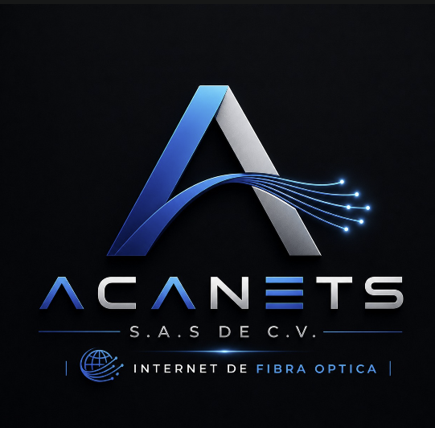

<picture>
  <source media="(prefers-color-scheme: dark)" srcset="./assets/acanets-logo-dark.png">
  <source media="(prefers-color-scheme: light)" srcset="./assets/acanets-logo-light.png">
  
</picture>

# 🌐 Conectamos el futuro de El Salvador

### 🚀 Internet de fibra óptica · Ingeniería · Sistemas

 

---

## 🧠 Tecnología hecha cerca

<table>
<tr>
<td width="55%" valign="top">

ACANETS, S.A.S. de C.V. es una empresa salvadoreña fundada por tres amigos con una visión clara: **acercar la tecnología a hogares, negocios y organizaciones**.

Nos especializamos en **internet por fibra óptica** y en el desarrollo de **soluciones tecnológicas a medida**, asegurando estabilidad, velocidad y crecimiento para cada cliente.

</td>
<td width="45%" valign="top">

### ✨ Nuestra promesa

> Conexiones estables, asesoría clara y acompañamiento profesional en cada proyecto.

✔ Diagnóstico transparente
✔ Soluciones escalables
✔ Soporte técnico cercano

</td>
</tr>
</table>

---

## 🛠️ Servicios

<table>
<tr>
<td align="center" width="33%">

### 🔌 Fibra óptica

Instalación y despliegue de redes modernas para hogares y proyectos.

</td>
<td align="center" width="33%">

### 🏠 Internet residencial

Planes ideales para estudio, trabajo, streaming y gaming.

</td>
<td align="center" width="33%">

### 💻 Ingeniería y sistemas

Consultoría, diseño e implementación de soluciones tecnológicas.

</td>
</tr>
</table>

---

## 📶 Planes de Internet

<table>
<tr>
<th>PLAN</th>
<th>VELOCIDAD</th>
<th>PRECIO</th>
<th>IDEAL PARA</th>
</tr>

<tr>
<td><strong>🟢 BÁSICO</strong></td>
<td align="center"><strong>20 Mbps</strong></td>
<td align="center"><strong>$20.00</strong></td>
<td>Uso cotidiano y navegación rápida</td>
</tr>

<tr>
<td><strong>🔵 ESTÁNDAR</strong></td>
<td align="center"><strong>30 Mbps</strong></td>
<td align="center"><strong>$24.99</strong></td>
<td>Streaming HD, trabajo remoto y gaming</td>
</tr>

<tr>
<td><strong>🟣 PREMIUM</strong></td>
<td align="center"><strong>40 Mbps</strong></td>
<td align="center"><strong>$28.00</strong></td>
<td>Hogares con múltiples dispositivos</td>
</tr>

</table>

 

💡 Todos los planes incluyen soporte técnico.
📌 Instalación y cobertura sujetas a evaluación previa.

---

## ⚙️ Nuestro proceso

| Paso | Acción         | Descripción                        |
| :--: | :------------- | :--------------------------------- |
|  01  | 🎧 Escuchamos  | Entendemos tus necesidades         |
|  02  | 🔍 Evaluamos   | Analizamos cobertura y condiciones |
|  03  | 💡 Proponemos  | Diseñamos la mejor solución        |
|  04  | 🛠️ Instalamos | Implementamos con precisión        |
|  05  | 🤝 Acompañamos | Soporte continuo y cercano         |

---

## 📲 ¿Listo para conectarte?

### 💬 <a href="https://wa.me/50376300536">Escríbenos por WhatsApp</a>

**📞 7630-0536**
**📍 El Salvador, Centroamérica**

---

<picture>
  <source media="(prefers-color-scheme: dark)" srcset="./assets/acanets-logo-dark.png">
  <source media="(prefers-color-scheme: light)" srcset="./assets/acanets-logo-light.png">
  
</picture>

### **ACANETS, S.A.S. de C.V.**

Internet de fibra óptica · Ingeniería · Sistemas

© 2026 ACANETS. Todos los derechos reservados.

